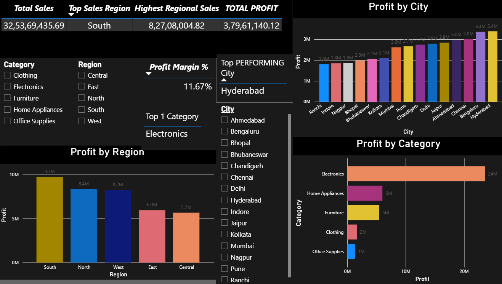

# 📊 Sales Analytics Dashboard

## 📌 About the Project

This project analyzes sales performance using Power BI.
The dashboard provides an interactive view of sales, orders,
customers, profitability, categories, regions, and cities.

The goal is to help identify sales trends and
high-performing areas to support business decisions.

## 🛠️ Tools Used

- Power BI
- Microsoft Excel
- Power Query
- DAX

## 📈 Key Performance Indicators

- Total Sales
- Total Orders
- Total Customers
- Total Profit
- Profit Margin %

## 🔍 Analysis Performed

- Sales by Category
- Sales by Region
- Sales by City
- Monthly Sales Trend
- Top Category
- Top City
- Profitability Analysis

## 💡 Key Insights

Detailed business insights will be documented based
on the results obtained from the dashboard.

## 📷 Dashboard Preview

## 🎯 Skills Demonstrated

- Data Cleaning
- Data Transformation
- Data Modeling
- DAX
- Data Visualization
- Business Analysis
- Power BI Dashboard Development
